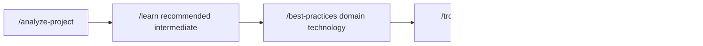

# Claude Code Command Ecosystem

## Overview

This directory contains Claude Code-aligned commands with **38 slash commands** organized into **8 categories** for development workflows. These commands support automation, learning resources, and quality assurance tools.

### **Command Statistics**

- **Total Commands**: 38 commands (~9,200 lines of content)
- **Coverage**: Complete development lifecycle from initialization to deployment
- **Quality**: Built-in safety and rollback procedures
- **Integration**: Coordination between commands and workflows

## Command Categories (8 Categories)

### **00-workflow/** (Workflow orchestration - 3 commands)
- `/project:chain` - Natural language workflow automation
- `/project:workflow-builder` - Visual workflow creation 
- `/project:smart-suggest` - Contextual recommendations

### **01-foundation/** (Project Setup - 4 commands)  
- `/project:bootstrap-project` - Complete project initialization
- `/project:analyze-project` - Project analysis
- `/project:validate-environment` - Development environment validation
- `/project:modernize` - Legacy system modernization

### **Phase 2: Workflow Commands (6 commands)**

**Automation workflows and system management**

| Command | Description | Usage Example |
|---------|-------------|---------------|
| `/backup` | Backup strategies | `/backup full-system automated versioned` |
| `/migrate` | Database and system migrations | `/migrate database schema-changes safe` |
| `/monitor` | Production monitoring setup | `/monitor alerts dashboards` |
| `/comply` | Regulatory compliance automation | `/comply soc2 audit-ready documentation` |
| `/modernize` | Legacy system modernization | `/modernize codebase architecture patterns` |
| `/harden` | Security hardening workflows | `/harden enterprise production paranoid` |

### **Phase 3: Context-Aware Commands (5 commands)**

**Project analysis and recommendations**

| Command | Description | Usage Example |
|---------|-------------|---------------|
| `/analyze-project` | AI-powered project assessment | `/analyze-project recommendations` |
| `/health-check` | System health checks | `/health-check full-stack performance` |
| `/quick-fix` | Targeted issue resolution | `/quick-fix critical production immediate` |
| `/smart-suggest` | Recommendations | `/smart-suggest optimization architecture` |
| `/validate-environment` | Environment verification | `/validate-environment production requirements` |

### **Phase 4: Utility Commands (6 commands)**

**Discovery, management, and development utilities**

| Command | Description | Usage Example |
|---------|-------------|---------------|
| `/list-prompts` | Command discovery and browsing | `/list-prompts security advanced filter` |
| `/search-prompts` | Content search | `/search-prompts "performance optimization"` |
| `/workflow-builder` | Visual workflow creation | `/workflow-builder create deployment-pipeline` |
| `/prompt-stats` | Usage analytics and metrics | `/prompt-stats team month detailed insights` |
| `/export-config` | Configuration sharing | `/export-config team portable standards` |
| `/debug-session` | Advanced troubleshooting | `/debug-session production critical analysis` |

### **Phase 5: Developer Lifecycle Commands (7 commands)**

**Daily development workflows and team coordination**

| Command | Description | Usage Example |
|---------|-------------|---------------|
| `/pre-commit` | Quality gates and validation | `/pre-commit strict security` |
| `/incident-response` | Production incident management | `/incident-response high performance production` |
| `/code-review` | Code analysis | `/code-review pr security thorough` |
| `/daily-standup` | Team coordination automation | `/daily-standup prepare team slack integration` |
| `/release-notes` | Multi-audience communication | `/release-notes v2.1.0 customer markdown detailed` |
| `/sprint-planning` | Sprint management | `/sprint-planning preparation 2-week capacity` |
| `/tech-debt` | Technical debt optimization | `/tech-debt assess full-codebase prioritize roi` |

### **Phase 6: Learning Commands (4 commands)**

**Skill development and knowledge management**

| Command | Description | Usage Example |
|---------|-------------|---------------|
| `/learn` | Interactive skill development | `/learn react advanced project hands-on` |
| `/best-practices` | Technology-specific guidance | `/best-practices security javascript project` |
| `/troubleshoot` | Systematic debugging assistance | `/troubleshoot error production critical guided` |
| `/knowledge-base` | Organizational knowledge management | `/knowledge-base create team confluence automated` |

### **Additional Specialized Commands (2 commands)**

**Specialized operations**

| Command | Description | Usage Example |
|---------|-------------|---------------|
| `/git` | Advanced Git operations | `/git workflow optimization branch-strategy` |
| `/mcp` | MCP server integration | `/mcp configure test advanced-features` |

## Command Relationships & Workflows

### **Project Setup Workflow**


### **Security-First Development Workflow**


### **Learning-Driven Growth Workflow**



## Directory Structure

```text
.claude/
├── README.md                          # This guide
├── config.json                        # Main project configuration
├── settings.local.json                # Local environment settings
├── commands/                           # All 38 slash commands
│   ├── [Phase 1: Category Commands]
│   │   ├── bootstrap-project.md
│   │   ├── audit-security.md
│   │   ├── refactor.md
│   │   ├── test.md
│   │   ├── document.md
│   │   ├── setup-ci.md
│   │   ├── deploy.md
│   │   └── optimize.md
│   ├── [Phase 2: Workflow Commands]
│   │   ├── backup.md
│   │   ├── migrate.md
│   │   ├── monitor.md
│   │   ├── comply.md
│   │   ├── modernize.md
│   │   └── harden.md
│   ├── [Phase 3: Context-Aware Commands]
│   │   ├── analyze-project.md
│   │   ├── health-check.md
│   │   ├── quick-fix.md
│   │   ├── smart-suggest.md
│   │   └── validate-environment.md
│   ├── [Phase 4: Utility Commands]
│   │   ├── list-prompts.md
│   │   ├── search-prompts.md
│   │   ├── workflow-builder.md
│   │   ├── prompt-stats.md
│   │   ├── export-config.md
│   │   └── debug-session.md
│   ├── [Phase 5: Developer Lifecycle Commands]
│   │   ├── pre-commit.md
│   │   ├── incident-response.md
│   │   ├── code-review.md
│   │   ├── daily-standup.md
│   │   ├── release-notes.md
│   │   ├── sprint-planning.md
│   │   └── tech-debt.md
│   ├── [Phase 6: Learning Commands]
│   │   ├── learn.md
│   │   ├── best-practices.md
│   │   ├── troubleshoot.md
│   │   └── knowledge-base.md
│   └── [Specialized Commands]
│       ├── git.md
│       └── mcp.md
└── workflows/                          # Automated workflow definitions
    └── full-development-cycle.yaml     # Complete development automation
```

## Configuration

### **config.json** - Main Project Configuration

```json
{
  "project": {
    "name": "ccprompts",
    "description": "Claude Code Developer Prompts Collection",
    "version": "1.0.0"
  },
  "settings": {
    "extended_thinking": "always",
    "permission_mode": "acceptEdits",
    "auto_commit": false,
    "backup_enabled": true
  },
  "conventions": {
    "commit_format": "conventional",
    "branch_naming": "feature/{category}-{description}",
    "pr_template": true
  }
}
```

### **settings.local.json** - Local Environment Settings

User-specific settings that override global configuration for local development.

## Quick Start Guide

### **1. Discovery & Assessment**

```bash
# Discover available commands
/list-prompts

# Analyze current project
/analyze-project

# Get personalized recommendations
/smart-suggest
```

### **2. Project Setup**

```bash
# Complete project initialization
/bootstrap-project web-app typescript cloud

# Security hardening
/harden enterprise

# Setup CI/CD pipeline
/setup-ci github professional
```

### **3. Development Workflow**

```bash
# Pre-commit quality checks
/pre-commit strict

# AI-powered code review
/code-review pr security thorough

# Team coordination
/daily-standup prepare team slack
```

### **4. Learning & Growth**

```bash
# Interactive skill development
/learn react advanced project

# Best practices guidance
/best-practices security javascript project

# Troubleshooting assistance
/troubleshoot error production critical
```

## Advanced Usage Patterns

### **Command Chaining for Complex Operations**

```bash
# Complete security workflow
/audit-security full → /harden enterprise → /comply soc2

# Full deployment pipeline
/test all → /code-review security → /deploy production

# Learning-driven development
/analyze-project → /learn recommended → /best-practices apply
```

### **Team Coordination Workflows**

```bash
# Sprint preparation
/sprint-planning → /tech-debt prioritize → /release-notes prepare

# Incident response
/health-check critical → /incident-response high → /debug-session production
```

### **Knowledge Management**

```bash
# Knowledge building
/export-config team → /knowledge-base create → /document all
```

## Safety & Quality Features

### **Built-in Safety Mechanisms**

- **Atomic Operations**: All changes are versioned and reversible
- **Validation**: Pre-execution safety checks
- **Rollback Procedures**: Safe undo for all modifications
- **Backup Integration**: Automatic backup before major changes

### **Quality Assurance**

- **Production Standards**: Quality-focused implementation
- **Security Design**: Built-in security scanning and compliance checks
- **Performance**: Efficient execution and resource usage
- **Educational Components**: Learning resources included

## Integration with Main Repository

### **Related Directories**

- **`../README.md`**: Main repository documentation and usage guide
- **`../CLAUDE.md`**: Project-specific guidance for Claude Code
- **`../CC-SDK-Guide.md`**: Advanced Claude Code SDK reference

## Usage Analytics & Optimization

### **Command Usage Tracking**

Use `/prompt-stats` to analyze:

- Most frequently used commands
- Team adoption patterns
- Success rates and optimization opportunities
- Learning progress and skill development

### **Performance Optimization**

- Commands are optimized for Claude Code's extended capabilities
- Efficient file operations and MCP server integration
- Minimal resource usage with maximum functionality
- Scalable for team and enterprise environments

## Contributing & Customization

### **Adding New Commands**

1. Create new `.md` file in appropriate category directory
2. Follow the established XML structure pattern
3. Include usage examples and safety procedures
4. Update this README.md with the new command reference

### **Customizing Workflows**

1. Modify existing workflow YAML files in `workflows/`
2. Create new workflow definitions for specific use cases
3. Test workflow integration with command ecosystem
4. Document workflow usage patterns and best practices

---

This command collection provides tools for AI-assisted development including automation, learning, and team support. The 38 commands extend Claude Code's capabilities to support development workflows and collaboration.
