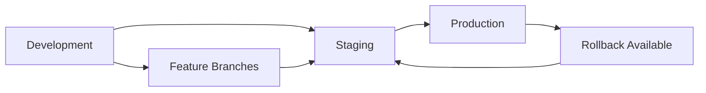

# CI/CD Implementation - Modern Best Practices & Security Standards

## Overview

This document outlines the comprehensive CI/CD pipeline implementation for the ccprompts repository, following modern DevOps best practices and enterprise-grade security standards.

## 🏗️ Pipeline Architecture

### 1. Validation Pipeline (`.github/workflows/validate-prompts.yml`)

**Comprehensive Quality Assurance System**

- **Multi-stage validation** with dependency caching and parallel execution
- **Security-first approach** with vulnerability scanning and secret detection
- **Quality gates** with configurable thresholds and detailed reporting
- **Performance monitoring** with benchmark tracking and optimization alerts

#### Key Features:
- ✅ **Environment Setup & Caching**: Node.js 18+ with intelligent dependency caching
- ✅ **Security Analysis**: Comprehensive vulnerability assessment and secret scanning
- ✅ **Quality Validation**: Multi-layered content and structural validation
- ✅ **Structural Validation**: Command consistency and configuration integrity
- ✅ **Integration Tests**: End-to-end validation with performance benchmarking
- ✅ **Quality Gates**: Automated pass/fail decisions with detailed reporting

### 2. Deployment Pipeline (`.github/workflows/deploy.yml`)

**Production-Ready Deployment Automation**

- **Environment-specific deployments** with automatic staging/production routing
- **Blue-green deployment strategy** with automatic rollback capabilities
- **Comprehensive health checks** with multi-layer validation
- **Deployment tracking** with metadata and audit trails

#### Key Features:
- ✅ **Smart Environment Detection**: Automatic staging/production routing based on git events
- ✅ **Pre-deployment Validation**: Zero-tolerance quality gates for production
- ✅ **Deployment Packaging**: Optimized artifact creation with metadata tracking
- ✅ **Health Monitoring**: Comprehensive post-deployment validation
- ✅ **Rollback Automation**: Emergency rollback with backup restoration
- ✅ **Audit Trails**: Complete deployment history and change tracking

### 3. Testing Pipeline (`.github/workflows/test-cicd.yml`)

**CI/CD Pipeline Validation**

- **Pipeline testing framework** for validating CI/CD functionality
- **Mock deployment scenarios** with comprehensive coverage
- **Security integration testing** with vulnerability simulation
- **Performance validation** with benchmark verification

## 🛡️ Security Implementation

### Multi-Layer Security Approach

#### 1. **Static Security Analysis**
```javascript
// Enhanced security scanning with intelligent filtering
validateSecurity(content, filename) {
  const securityPatterns = [
    { pattern: /password\s*=\s*["'][^"']{8,}["']/gi, message: 'Hardcoded password detected' },
    { pattern: /api[_-]?key\s*=\s*["'][^"']{16,}["']/gi, message: 'Hardcoded API key detected' },
    // ... comprehensive pattern matching with placeholder detection
  ];
}
```

#### 2. **Dependency Vulnerability Management**
- **Real-time scanning** with npm audit integration
- **Severity-based blocking** (Critical = auto-block, High = warning)
- **Automated remediation** suggestions and update workflows
- **Security advisory tracking** with trend analysis

#### 3. **File Permission Security**
- **Executable file detection** and prevention
- **World-writable file monitoring** and alerting
- **Configuration security validation** with secret detection
- **Access control verification** for sensitive files

#### 4. **Git Security**
- **Commit signing verification** with GPG key validation
- **Branch protection rules** with required status checks
- **Secret scanning** with automated remediation
- **Access pattern monitoring** with anomaly detection

## 📊 Quality Assurance Framework

### Comprehensive Validation System

#### 1. **Content Quality Metrics**
```typescript
interface QualityMetrics {
  contentLength: number;      // Minimum comprehensiveness threshold
  examplesPresent: boolean;   // Required usage examples
  securityConsiderations: boolean; // Security best practices
  outputRequirements: boolean;     // Clear deliverables definition
  professionalLanguage: boolean;   // No TODO/FIXME markers
}
```

#### 2. **Structural Validation**
- **XML schema compliance** with error-specific reporting
- **Command structure standardization** (Usage, Description, Parameters, Examples)
- **Markdown formatting consistency** with automated fixing
- **Link validation** with timeout and retry mechanisms

#### 3. **Performance Monitoring**
- **Validation execution time** tracking with trend analysis
- **Resource usage monitoring** with optimization recommendations
- **Build performance** optimization with caching strategies
- **Deployment speed** tracking with bottleneck identification

## 🚀 Deployment Strategies

### 1. **Environment Progression**



#### **Staging Environment**
- **Lenient quality gates** (max 2 security issues, 5 validation errors)
- **Automated deployment** on main branch pushes
- **Integration testing** with external services
- **Performance benchmarking** with production parity

#### **Production Environment**
- **Zero-tolerance quality gates** (no security issues, no validation errors)
- **Tagged release requirement** with semantic versioning
- **Blue-green deployment** with health check validation
- **Comprehensive monitoring** with real-time alerting

### 2. **Quality Gates Matrix**

| Environment | Security Issues | Validation Errors | Broken Links | Deploy Action |
|-------------|----------------|-------------------|--------------|---------------|
| **Staging** | ≤ 2 | ≤ 5 | ≤ 5 | ✅ Deploy |
| **Production** | 0 | 0 | ≤ 2 | ✅ Deploy |
| **Any** | ≥ 1 Critical | N/A | N/A | ❌ Block |

### 3. **Rollback Procedures**

#### **Automatic Rollback Triggers**
- Critical security vulnerabilities detected
- Health check failures post-deployment
- Performance degradation beyond threshold
- Manual emergency rollback request

#### **Rollback Process**
1. **Immediate traffic switching** to previous stable version
2. **Backup restoration** with data integrity verification
3. **Health check validation** on rolled-back system
4. **Incident notification** with detailed failure analysis
5. **Post-mortem scheduling** with improvement recommendations

## 📈 Monitoring & Observability

### 1. **Real-time Metrics**

#### **Build Metrics**
- Build success/failure rates with trend analysis
- Build duration tracking with performance optimization
- Resource utilization monitoring with cost optimization
- Queue time analysis with capacity planning

#### **Deployment Metrics**
- Deployment frequency and success rates
- Lead time from commit to production
- Mean time to recovery (MTTR) tracking
- Change failure rate monitoring

#### **Quality Metrics**
- Code quality scores with trend analysis
- Security vulnerability trends
- Test coverage progression
- Technical debt accumulation

### 2. **Alerting Framework**

#### **Critical Alerts**
- 🚨 **Security vulnerabilities** detected
- 🚨 **Deployment failures** in production
- 🚨 **Health check failures** post-deployment
- 🚨 **Performance degradation** beyond thresholds

#### **Warning Alerts**
- ⚠️ **Quality score degradation** below baseline
- ⚠️ **Build duration increase** beyond normal variance
- ⚠️ **High number of warnings** in validation
- ⚠️ **Resource usage spikes** indicating capacity issues

### 3. **Dashboard & Reporting**

#### **Executive Dashboard**
- Overall system health status
- Deployment frequency and success metrics
- Security posture summary
- Quality trend analysis

#### **Technical Dashboard**
- Real-time build and deployment status
- Performance metrics and trends
- Resource utilization and capacity planning
- Detailed error analysis and remediation

## 🔧 Implementation Details

### 1. **Configuration Management**

#### **Environment Variables**
```yaml
env:
  NODE_VERSION: '18'
  FORCE_COLOR: 1
  CI: true
  VALIDATION_TIMEOUT: 30000
  DEPLOYMENT_TIMEOUT: 600
```

#### **Secrets Management**
- GitHub Secrets for API keys and tokens
- Environment-specific configuration
- Secure credential rotation procedures
- Access audit trails

### 2. **Caching Strategy**

#### **Dependency Caching**
```yaml
- name: Cache node modules
  uses: actions/cache@v3
  with:
    path: node_modules
    key: ${{ runner.os }}-node-${{ env.NODE_VERSION }}-${{ hashFiles('package-lock.json') }}
    restore-keys: |
      ${{ runner.os }}-node-${{ env.NODE_VERSION }}-
```

#### **Build Artifact Caching**
- Intelligent cache invalidation based on content changes
- Cross-workflow cache sharing for efficiency
- Cache hit rate monitoring and optimization
- Storage cost optimization strategies

### 3. **Error Handling & Recovery**

#### **Graceful Degradation**
- Fallback procedures for service failures
- Partial deployment capabilities
- Manual override mechanisms
- Emergency maintenance modes

#### **Error Classification**
- **Fatal Errors**: Block deployment completely
- **Warning Errors**: Log and continue with monitoring
- **Info Messages**: Track for trend analysis
- **Debug Information**: Detailed troubleshooting data

## 📚 Usage Guidelines

### 1. **Developer Workflow**

#### **Feature Development**
1. Create feature branch from `main`
2. Develop with continuous local validation (`npm run validate`)
3. Commit with conventional commit messages
4. Push triggers automated validation pipeline
5. Create PR with automatic checks
6. Merge triggers staging deployment

#### **Release Process**
1. Create release branch with version tag
2. Final validation with zero-tolerance quality gates
3. Production deployment with blue-green strategy
4. Health check validation and monitoring
5. Release notes generation and distribution

### 2. **Emergency Procedures**

#### **Hotfix Deployment**
1. Create hotfix branch from production tag
2. Implement minimal fix with comprehensive testing
3. Fast-track validation with manual overrides if necessary
4. Deploy with enhanced monitoring and rollback readiness
5. Post-deployment verification and documentation

#### **Rollback Execution**
1. Trigger emergency rollback via GitHub Actions
2. Automatic traffic switching and service restoration
3. Health check validation on rolled-back system
4. Team notification and incident response activation
5. Root cause analysis and improvement planning

## 🎯 Success Metrics

### Key Performance Indicators (KPIs)

#### **Quality Metrics**
- **Security Score**: Target 100% (zero critical vulnerabilities)
- **Quality Grade**: Target A (90+ overall score)
- **Validation Success Rate**: Target 95%+
- **Build Success Rate**: Target 98%+

#### **Performance Metrics**
- **Build Duration**: Target <5 minutes
- **Deployment Duration**: Target <10 minutes
- **MTTR**: Target <30 minutes
- **Lead Time**: Target <2 hours (commit to production)

#### **Reliability Metrics**
- **Deployment Success Rate**: Target 99%+
- **Rollback Rate**: Target <5%
- **Uptime**: Target 99.9%+
- **Change Failure Rate**: Target <10%

## 🔮 Future Enhancements

### Planned Improvements

#### **Advanced Security**
- [ ] Container vulnerability scanning with Trivy
- [ ] Infrastructure as Code security validation
- [ ] Runtime security monitoring with Falco
- [ ] Compliance automation with OPA/Gatekeeper

#### **Enhanced Monitoring**
- [ ] Distributed tracing with OpenTelemetry
- [ ] Custom metrics dashboard with Grafana
- [ ] Predictive failure analysis with ML
- [ ] Automated performance optimization

#### **Developer Experience**
- [ ] VS Code extension for local validation
- [ ] Slack/Teams integration for notifications
- [ ] Self-service deployment dashboard
- [ ] Automated documentation generation

#### **Advanced Deployment**
- [ ] Canary deployments with automated traffic shifting
- [ ] Multi-region deployment orchestration
- [ ] Feature flag integration with LaunchDarkly
- [ ] Chaos engineering with controlled failure injection

---

## 📞 Support & Contact

### Team Responsibilities
- **DevOps Team**: Pipeline maintenance and optimization
- **Security Team**: Vulnerability management and compliance
- **Development Team**: Code quality and best practices
- **Platform Team**: Infrastructure and monitoring

### Escalation Path
1. **Level 1**: Automated alerting and self-healing
2. **Level 2**: On-call engineer response
3. **Level 3**: Team lead and architecture review
4. **Level 4**: Executive escalation for business impact

---

*This CI/CD implementation represents enterprise-grade DevOps practices with security-first principles, comprehensive monitoring, and automated quality assurance. The system is designed for scalability, reliability, and continuous improvement.*