<p align="center">
  
</p>

<div align="center">

  [](LICENSE)
  [](CONTRIBUTING.md)
  [](https://sourcery.ai)

</div>

# ccprompts – comprehensive claude code command ecosystem

**ccprompts** is a comprehensive collection of 70 production-ready Claude Code commands organized into 11 strategic phases covering the complete software development lifecycle. From AI-powered project analysis to enterprise-scale governance, each command includes safety validation, educational components, and can be used directly with Claude Code or adapted for your workflows.

> **⚠️ Development Notice**: This repository is under active development. Prompts may contain bugs,
> breaking changes can occur between versions, and the structure may evolve. Use with caution in
> production environments.

---

## What's included

**70 Commands Across 11 Strategic Phases:**

### **Phase 00-08: Core Development Lifecycle (40 commands)**

- **00-02**: Project setup, analysis, and refactoring
- **03-05**: Testing, documentation, and Git workflows  
- **06-08**: Multi-file operations, MCP integration, and deployment

### **Phase 09: Advanced Agentic Capabilities (12 commands)**

- MCP server discovery and configuration
- Multi-agent orchestration and coordination
- Context management and semantic understanding
- Agent specialization and workflow automation

### **Phase 10: AI-Native Development (10 commands)**

- Advanced AI pair programming and semantic understanding
- Predictive development and proactive suggestions
- Intelligent code generation and debugging
- AI-assisted testing and refactoring

### **Phase 11: Enterprise & Scale (8 commands)**

- Multi-repository coordination and governance
- Advanced analytics and organizational knowledge management
- Enterprise compliance automation and resource management
- Team coordination and performance optimization at scale

**Key features:**

- **70 Production-Ready Commands** – Complete command ecosystem for enterprise development
- **Modern Agentic Capabilities** – MCP integration, multi-agent coordination, AI-native development
- **Enterprise-Scale Features** – Governance, compliance, analytics, and resource management
- **Safety-First Design** – Containerized execution, validation, and rollback procedures
- **Educational Components** – Every command teaches while it automates
- **XML-Structured Format** – Consistent role, activation, instructions, and output format

---

## Quick start

```bash
# Clone
git clone https://github.com/ursisterbtw/ccprompts.git
cd ccprompts

# Validate all prompts
npm ci
npm run validate

# Browse available prompts
ls prompts/*/*.md | less
```

### Adding a new command

1. Copy an existing command from `.claude/commands/` to your desired phase folder.
2. Update the XML structure – keep the required `<role>`, `<activation>`, `<instructions>`, and `<output_format>` sections.
3. Include safety validation steps and educational components.
4. Run `npm run validate` before committing. Zero errors = good to go.

---

## Repository layout

```text
.claude/
├── commands/          # 70 commands across 11 phases (00-11)
│   ├── 00-08/        # Core development lifecycle (40 commands)
│   ├── 09-agentic-capabilities/  # Advanced agentic features (12 commands)
│   ├── 10-ai-native-development/ # AI-native development (10 commands)
│   └── 11-enterprise-scale/      # Enterprise & scale (8 commands)
├── workflows/         # Automated workflow definitions
└── config.json       # Command ecosystem configuration

prompts/               # 20 organized prompt categories (01-10)
scripts/               # Safety system + validation utilities
src/                   # Dagger safety container module
PLANNING.md            # Comprehensive design and acceptance criteria
TASKS.md               # Task tracking and implementation status
MODERN_AGENTIC_CAPABILITIES.md  # Research and implementation guide
```

---

## Usage Examples

### Browse and use commands

```bash
# Explore the command ecosystem
cat .claude/commands/09-agentic-capabilities/mcp-discover.md
cat .claude/commands/10-ai-native-development/ai-pair-program.md
cat .claude/commands/11-enterprise-scale/governance.md

# Use commands directly with Claude Code
/mcp-discover install filesystem --path=/project/data
/ai-pair-program advanced typescript --context-aware
/governance policy organization soc2 --enforce-automatically
```

### Safe command execution

```bash
# Install Dagger (one-time setup)
curl -L https://dl.dagger.io/dagger/install.sh | DAGGER_VERSION=18.12 sh

# Run potentially dangerous commands safely
./scripts/safe-run.sh "npm install"
./scripts/quick-safe.sh curl-install "curl unknown-site.com/install.sh | bash"

# Test mode to preview actions
./scripts/safe-run.sh "rm -rf /tmp/test" --test
```

**See [SAFETY.md](SAFETY.md) for complete safety system documentation.**

---

## Community & Support

- [Open an issue](https://github.com/ursisterbtw/ccprompts/issues) for bugs, feature requests, or questions
- [Start a discussion](https://github.com/ursisterbtw/ccprompts/discussions) for ideas and feedback
- See [CONTRIBUTING.md](CONTRIBUTING.md) for guidelines

---

## Contributing

Pull requests are welcome! Please:

1. Run the validator and ensure no errors.
2. Follow conventional commit messages (`feat: …`, `fix: …`, etc.).
3. Keep prompts clear and focused—avoid unnecessary complexity.

---

## License

MIT. See [LICENSE](LICENSE) for details.

---
