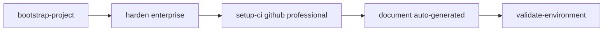
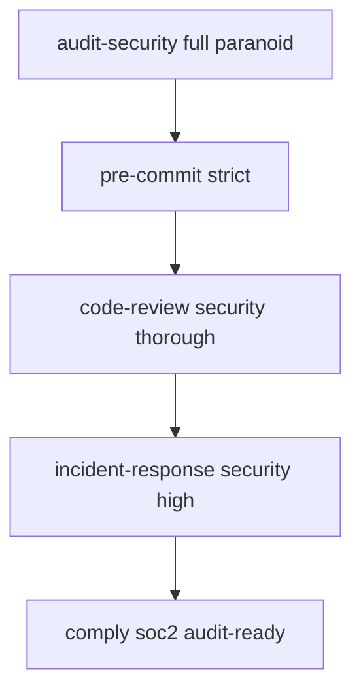
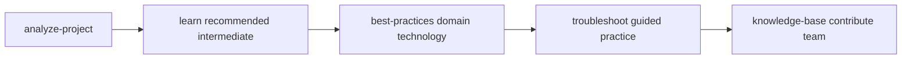

# Claude Code Command Ecosystem

<!-- markdownlint-disable MD033 -->
<div align="center">
  
</div>
<!-- markdownlint-enable MD033 -->

A comprehensive collection of **38 production-ready Claude Code commands** that transform development workflows through AI-powered automation, intelligent analysis, and continuous learning integration.

## 🚀 Complete Command Ecosystem

### **38 Commands Across 6 Development Phases**

| Phase | Commands | Focus Area |
|-------|----------|------------|
| **📁 Category Commands** | 8 commands | Core development operations |
| **🔄 Workflow Commands** | 6 commands | Advanced automation workflows |
| **🧠 Context-Aware Commands** | 5 commands | Intelligent project analysis |
| **🛠️ Utility Commands** | 6 commands | Discovery and management |
| **📊 Developer Lifecycle Commands** | 7 commands | Daily development workflows |
| **📚 Learning Commands** | 4 commands | Skill development and knowledge |

## 🎯 Quick Command Access

### **Essential Commands**

```bash
# Project Setup & Analysis
/bootstrap-project web-app typescript cloud    # Complete project initialization
/analyze-project                               # AI-powered project assessment
/health-check comprehensive                    # Full system health evaluation

# Development Workflow
/pre-commit strict                             # Comprehensive quality gates
/code-review pr security thorough              # AI-powered code analysis
/daily-standup prepare team slack              # Automated standup preparation

# Learning & Growth
/learn react advanced project                  # Interactive skill development
/best-practices security javascript project   # Technology-specific guidance
/troubleshoot error production critical        # Intelligent debugging assistance
```

### **Discovery & Management**

```bash
# Find & Organize
/list-prompts security advanced                # Browse available prompts
/search-prompts "performance optimization"     # Intelligent content search
/workflow-builder create                       # Visual workflow creation

# Knowledge & Analytics
/knowledge-base create team confluence         # Automated knowledge management
/prompt-stats team month detailed             # Usage analytics and insights
/tech-debt assess full-codebase high          # Technical debt analysis
```

## ✨ Revolutionary Features

### **🤖 AI-Powered Intelligence**

- **Contextual Analysis**: Commands adapt to your specific project and technology stack
- **Pattern Recognition**: Intelligent detection of issues, opportunities, and best practices
- **Personalized Recommendations**: AI-driven suggestions based on project characteristics
- **Predictive Analytics**: Forecast potential issues and optimization opportunities

### **🔗 Seamless Integration**

- **Claude Code Native**: Leverages unique file operations, MCP servers, and git workflows
- **Multi-Tool Coordination**: Commands work together for complex, multi-step operations
- **Real-Time Collaboration**: Team-aware features with live coordination and communication
- **Enterprise Ecosystem**: Integrates with existing CI/CD, monitoring, and collaboration tools

### **📈 Continuous Learning**

- **Skill Development**: Interactive tutorials and hands-on exercises
- **Knowledge Management**: Automated documentation and organizational learning
- **Progress Tracking**: Personal and team growth analytics
- **Best Practice Evolution**: Continuously updated recommendations based on industry trends

### **🛡️ Enterprise-Grade Safety**

- **Atomic Operations**: All changes are versioned, tested, and reversible
- **Security-First**: Built-in security scanning, compliance checking, and risk assessment
- **Quality Gates**: Automated quality assurance with customizable thresholds
- **Audit Trails**: Comprehensive logging and change tracking for compliance

## 🎓 Learning & Development Integration

### **Interactive Learning System**

```bash
# Skill Development
/learn python beginner tutorial               # Step-by-step language learning
/learn kubernetes intermediate workshop       # Hands-on container orchestration
/learn claude-code advanced mentorship        # AI-assisted development mastery

# Knowledge Building
/best-practices architecture organization     # Organizational standards
/troubleshoot performance development medium  # Systematic debugging skills
/knowledge-base extract team "security patterns"  # Team knowledge capture
```

### **Team Coordination & Growth**

```bash
# Development Lifecycle
/sprint-planning preparation 2-week           # AI-assisted sprint planning
/incident-response high performance production # Structured crisis management
/release-notes v2.1.0 customer markdown       # Multi-audience communication

# Quality & Standards
/tech-debt prioritize service critical        # ROI-based debt management
/export-config full team portable             # Team configuration sharing
/validate-environment                          # Comprehensive environment checks
```

## 🏗️ Repository Structure

```text
ccprompts/
├── prompts/                           # 20 organized prompt categories
│   ├── 01-project-initialization/     # Bootstrap & CLAUDE.md generation
│   ├── 02-code-analysis/             # Security audits & dependency analysis
│   ├── 03-refactoring/               # Modernization & performance optimization
│   ├── 04-testing/                   # Test suite generation & mutation testing
│   ├── 05-documentation/             # Documentation & knowledge management
│   ├── 06-git-workflows/             # Git automation & repository management
│   ├── 07-multi-file-operations/     # Cross-codebase refactoring
│   ├── 08-mcp-integration/           # MCP server configuration & testing
│   ├── 09-build-deployment/          # CI/CD pipelines & Infrastructure as Code
│   ├── 10-security-compliance/       # Security hardening & compliance
│   └── INDEX.md                      # Detailed prompt directory guide
├── .claude/                          # 38 custom commands + workflows
│   ├── README.md                     # Complete command ecosystem guide
│   ├── commands/                     # All 38 slash commands for instant access
│   ├── workflows/                    # Automated multi-command workflows
│   └── config.json                   # Enterprise-grade configuration
├── assets/                           # Visual assets and diagrams
│   └── ccprompts.svg                 # Animated ecosystem visualization
├── README.md                         # This comprehensive guide
├── CLAUDE.md                         # Project-specific guidance for Claude Code
└── CC-SDK-Guide.md                   # Advanced Claude Code SDK reference
```

## 🔄 Workflow Examples

### **Complete Project Setup**



### **Security-First Development**



### **Learning-Driven Growth**



## 💡 Advanced Use Cases

### **Enterprise Team Leadership**

- **Project Health Monitoring**: Continuous assessment of code quality, security, and performance
- **Team Skill Development**: Personalized learning paths and capability building
- **Process Optimization**: Data-driven workflow improvements and automation
- **Compliance Management**: Automated regulatory compliance and audit preparation

### **Senior Developer Productivity**

- **Intelligent Code Review**: AI-powered analysis with educational explanations
- **Technical Debt Management**: ROI-based prioritization and resolution tracking
- **Knowledge Sharing**: Automated documentation and mentorship facilitation
- **Continuous Integration**: Seamless CI/CD pipeline management and optimization

### **Growing Developer Support**

- **Interactive Learning**: Hands-on tutorials integrated with real project work
- **Debugging Assistance**: Systematic troubleshooting with skill development
- **Best Practice Guidance**: Context-aware recommendations and explanations
- **Collaborative Development**: Team coordination and communication automation

## 🛠️ Customization & Extension

### **Technology Stack Adaptation**

- **Language Support**: Python, TypeScript, JavaScript, Go, Rust, Java, C#, PHP, Ruby
- **Framework Integration**: React, Vue, Angular, Django, FastAPI, Express, Spring Boot
- **Cloud Platforms**: AWS, GCP, Azure, with Infrastructure as Code automation
- **Development Tools**: Docker, Kubernetes, Terraform, GitHub Actions, GitLab CI

### **Organizational Integration**

- **Compliance Frameworks**: SOC2, GDPR, HIPAA, PCI DSS, ISO 27001
- **Team Collaboration**: Slack, Teams, Jira, Confluence, Notion integration
- **Monitoring & Analytics**: DataDog, New Relic, Grafana, custom dashboard support
- **Enterprise Security**: SSO, RBAC, audit trails, and policy enforcement

## 🚀 Getting Started

### **1. Instant Setup**

```bash
# Clone and explore the ecosystem
git clone https://github.com/ursisterbtw/ccprompts.git
cd ccprompts

# Discover available commands
/list-prompts

# Analyze your current project
/analyze-project

# Get personalized recommendations
/smart-suggest
```

### **2. Team Onboarding**

```bash
# Export team configuration
/export-config team portable

# Create team knowledge base
/knowledge-base create team confluence

# Setup learning paths
/learn team-onboarding beginner tutorial
```

### **3. Production Readiness**

```bash
# Comprehensive security assessment
/audit-security full-codebase paranoid

# Setup production pipeline
/setup-ci github enterprise

# Implement monitoring
/monitor comprehensive production
```

## 🤝 Contributing & Community

This project represents a new paradigm in AI-assisted development - where every command teaches, every workflow learns, and every interaction builds team capability. We welcome contributions that extend this vision of intelligent, educational, and collaborative development automation.

### **Contribution Guidelines**

1. **Educational Value**: All commands should teach while they automate
2. **Safety First**: Include comprehensive verification and rollback procedures
3. **Team Collaboration**: Design for team environments and knowledge sharing
4. **Enterprise Ready**: Meet production-grade security and compliance standards
5. **Continuous Learning**: Integrate learning opportunities and skill development

---

**Transform your development workflow with 38 AI-powered commands that don't just automate tasks—they elevate teams, accelerate learning, and ensure enterprise-grade quality at every step.**

## 📚 Related Documentation

- **[.claude/README.md](.claude/README.md)** - Complete command ecosystem guide with detailed usage examples
- **[prompts/INDEX.md](prompts/INDEX.md)** - Comprehensive prompt directory and category descriptions  
- **[CLAUDE.md](CLAUDE.md)** - Project-specific guidance and development principles
- **[CC-SDK-Guide.md](CC-SDK-Guide.md)** - Advanced Claude Code SDK reference and integration guide
